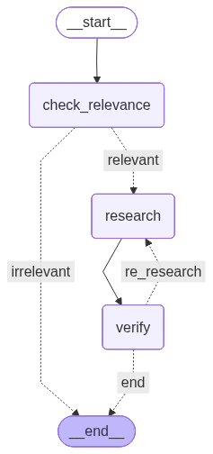
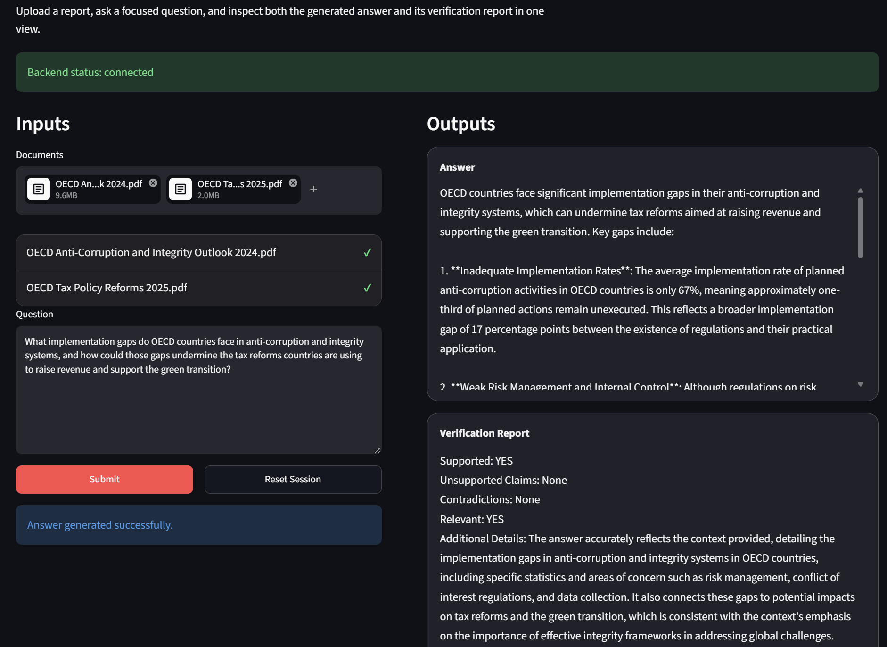

# Agentic RAG App

## General overview
This repository addresses a common limitation of modern language models: while they can generate fluent answers, they often struggle to reason reliably over long, information-dense documents such as policy reports, technical papers, and institutional publications. The system is designed to turn such documents into a searchable evidence base, produce concise grounded answers, and surface a verification signal so that responses remain explicitly tied to the uploaded source material.

## Technical overview
The project implements an agentic retrieval-augmented generation architecture exposed through a FastAPI backend and a Streamlit frontend. Uploaded documents are parsed with Docling, segmented into structured chunks, indexed through a hybrid retrieval layer that combines BM25 with dense vector search, and passed through a LangGraph workflow in which specialized agents perform relevance classification, answer generation, and evidence-based verification using OpenAI models.

## Key techniques
- **Document conversion and chunking**: `Docling` transforms uploaded files into markdown; `MarkdownHeaderTextSplitter` creates retrieval-ready chunks.
- **Chunk caching**: processed document chunks are cached on disk to avoid repeated parsing of unchanged files.
- **Hybrid retrieval**: `BM25Retriever` and `Chroma` with OpenAI embeddings are combined through an `EnsembleRetriever`.
- **Agentic orchestration**: `LangGraph` coordinates a relevance checker, a research agent, and a verification agent.
- **Model backend**: OpenAI chat models generate answers, validate evidence support, and classify document relevance.
- **Service split**: the backend exposes the pipeline as an API; the frontend acts as a lightweight client over HTTP.

### Workflow diagram

The diagram below is generated directly from the LangGraph workflow, so it reflects the actual control flow between relevance checking, answer generation, verification, and retry routing.

In this setting, agentic RAG means that retrieval is not followed by a single generation step; instead, specialized agents use the retrieved evidence to decide whether the question is answerable, draft a response, verify that response against the source material, and trigger another pass when support is insufficient.



## Key commands

Install dependencies locally:

```bash
poetry install --with backend,frontend
```

Run with Docker Compose:

```bash
docker compose up --build
```

Application endpoints:

```text
Frontend UI: http://localhost:7860
Backend API: http://localhost:8000
```

### Example interface result:

This example shows the interface handling multiple OECD reports at once, answering a cross-document analytical question, and returning both a grounded response and a verification report that makes evidence support explicit.



## Repository structure

```text
agentic-rag-app/
├── assets/                  # Documentation visuals and generated diagrams
│   ├── ui-example.png
│   └── workflow_diagram.png
├── backend/                 # FastAPI app, retrieval pipeline, and agent workflow
│   ├── agents/              # Specialized agents used by the LangGraph workflow
│   │   ├── relevance.py
│   │   ├── research.py
│   │   └── verification.py
│   ├── agent_workflow.py
│   ├── api.py
│   ├── document_processing.py
│   ├── log_config.py
│   ├── openai_client.py
│   ├── rag_service.py
│   └── settings.py
├── frontend/                # Streamlit user interface and backend client
│   ├── app.py
│   ├── client.py
│   ├── config.py
│   └── launcher.py
├── Dockerfile.backend       # Backend container image definition
├── Dockerfile.frontend      # Frontend container image definition
├── docker-compose.yml       # Local multi-container orchestration
├── pyproject.toml           # Poetry dependencies and project scripts
└── run.py                   # Convenience launcher for local development
```
